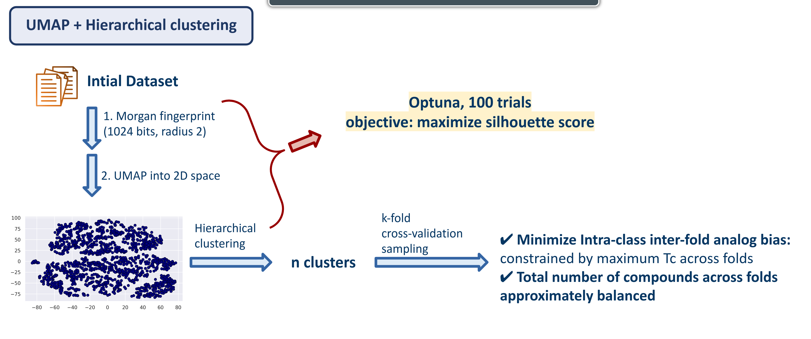

# k-fold cross-validation sampling using UMAP-based dimensionality combined with agglomerative clustering

This implementation is inspired by the work of [Guo et al (2025)](https://link.springer.com/article/10.1186/s13321-025-01039-8). In this paper, the authors demonstrate that UMAP-based splitting creates significantly more challenging and realistic benchmarks for model evaluation than traditional methods (such as random, scaffold-based, or Butina splits). Consequently, UMAP splits are highly recommended for evaluating molecular property prediction and virtual screening tasks.

This code provides an enhanced and end-to-end, ready-to-use UMAP-based splitting that incorporates hyperparameter optimization for `n_clusters`, `n_neighbors`, `min_dist` using [Optuna](https://optuna.org/), followed by the assignment of samples to k-fold cross-validation splits while enforcing predefined maximum Tanimoto similarity constraints between folds.

## Workflow


## Installation

```
cd ~/
git clone https://github.com/caominhtr/umap_clustering_sampling.git
cd umap_clustering_sampling
conda env create -f CBS.yaml
conda activate CBS
```

## Execution

The example of dataset in `.smi` format can be found at `example.smi`. Each row corresponds to a SMILES string with its ID. Inputs can also be prepared in `.csv` or `.txt` formats.

```
python script.py \
    --input example.smi \
    --output results/ \
    --folds 5 \
    --trials 100 \
    --threshold 0.68 \
    --seed 42
```

where:

- `--input`: Input file containing molecule IDs and SMILES.
- `--output`: Directory where output files will be saved.
- `--folds`: Number of cross-validation folds.
- `--trials`: Number of Optuna optimization trials.
- `--threshold`: Maximum Tanimoto similarity (`T_c`) across folds.
- `--seed`: Random seed for reproducibility.

